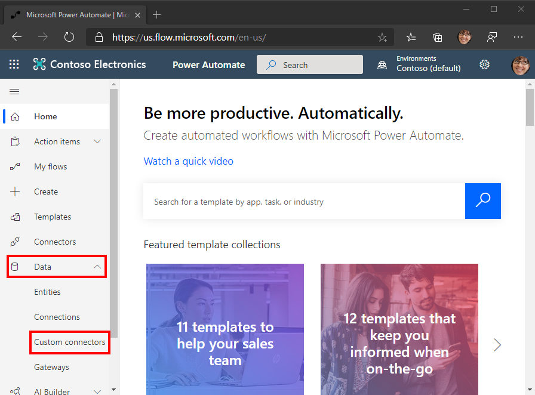
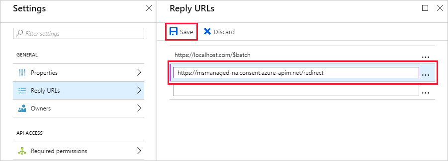

<!-- markdownlint-disable MD002 MD041 -->

In this exercise, you will create a new custom connector which can be used in Flow or in Azure Logic Apps. The Open API definition file is prebuilt with the correct path for the Microsoft Graph `$batch` endpoint and additional settings to enable simple import.

Using a text editor, create a new empty file named `MSGraph-Delegate-Batch.swagger.json` and add the following code.

[!code-json]

Open a browser and navigate to [Microsoft Flow](https://flow.microsoft.com). Sign in with your Office 365 tenant administrator account. Choose the gear icon in the upper right, and select the **Custom Connectors** item in the drop-down menu.

On the **Custom Connectors** page choose the **Create custom connector** link in the top right, then select the **Import an Open API file** item in the drop-down menu.

 

Enter `MS Graph Batch Connector` in the **Custom connector name** text box. Choose the folder icon to upload the Open API file. Browse to the `MSGraph-Delegate-Batch.swagger.json` file you created. Choose **Continue** to upload the Open API file.

 

On the connector configuration page, choose the **Security** link in the navigation menu. Fill in the fields as follows.

- **Choose what authentication is implemented by your API**: `OAuth 2.0`
- **Identity Provider**: `Azure Active Directory`
- **Client id**: the application ID you created in the previous exercise
- **Client secret**: the key you created in the previous exercise
- **Login url**: `https://login.windows.net`
- **Tenant ID**: `common`
- **Resource URL**: `https://graph.microsoft.com` (no trailing /)
- **Scope**: Leave blank

Choose **Create Connector** on the top-right

After the connector has been created, copy the generated **Redirect URL**.

Go back to the registered application in the [Azure Portal](https://aad.portal.azure.com) you created in the previous exercise. Select **Reply URLs** in the **Settings** blade. Add the **Redirect URL** you copied as an additional **Reply URL**. Save the application in Azure Active Directory portal.

